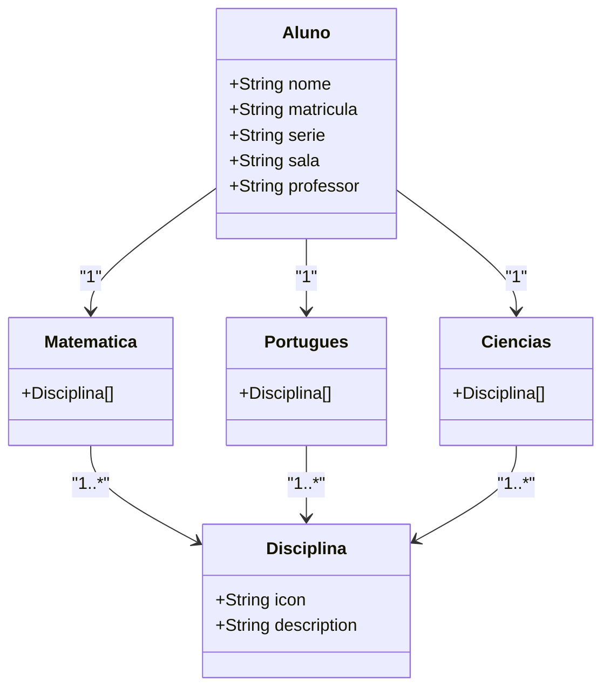

## PROJETO ESCOLA

Java RESTful API

## Diagrama de Classes (Domínio da API)

    Esse projeto básico representa a estrutura sugerida no JSON e cria uma API para visualizar os dados do aluno e suas disciplinas.